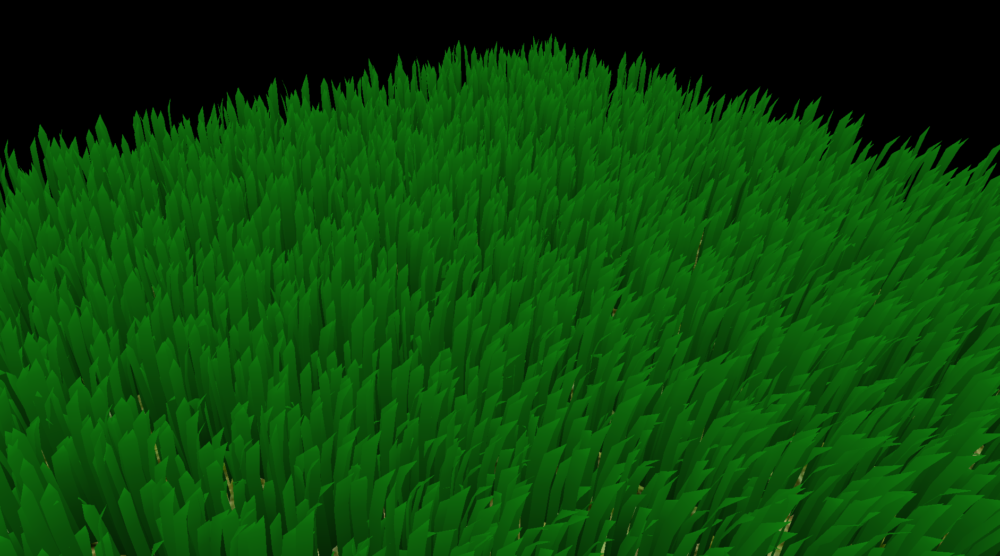

Vulkan Grass Rendering
==================================

**University of Pennsylvania, CIS 565: GPU Programming and Architecture, Project 5**

* Saahil Gupta
  * [LinkedIn](https://www.linkedin.com/in/saahil-g), [personal website](https://www.saahil-gupta.com)
* Tested on: Windows 11 10.0.26100, AMD Ryzen 9 7940HS @ 4.0GHz 32GB, RTX 4060 Laptop GPU 8GB

<em>Vulkan Grass Rendering</em>

This project implements a real-time grass simulation and renderer using Vulkan. Grass blades are represented as Bezier curves and simulated on the GPU using compute shaders, which apply environmental forces such as gravity, wind, and recovery while also performing per-frame culling to remove blades that do not contribute to the final image. Visible blades are rendered through a dedicated graphics pipeline that uses vertex, tessellation, and fragment shaders to dynamically generate and shade grass geometry. By combining GPU-based simulation, culling, and tessellation, this project demonstrates an efficient and scalable approach to rendering large amounts of animated grass in real time.

### Build and Run Instructions
- Clone the repository to your machine
- Configure CMake with either the `clang++` or `msvc` presets
- Build into the `build` or `bin` folders respectively
- `cd` into the `build` folder so the program can find the shader `.spv` files
- Run the executable from the `build` directory